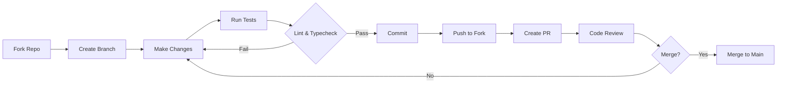

# Contributing to Relax Sound

<p align="center">
  <picture>
    <source media="(prefers-color-scheme: dark)" srcset="https://img.shields.io/badge/Contributing-Guide-6d28d9?style=for-the-badge&logo=contributorcovenant&logoColor=white&labelColor=1e1b4b">
    
  </picture>
</p>

<div align="center">

[](https://conventionalcommits.org)
[](CODE_OF_CONDUCT.md)
[](https://github.com/sanot-tech/Relax-Sound/pulls)

</div>

---

## Table of Contents

- [Code of Conduct](#code-of-conduct)
- [Getting Started](#getting-started)
- [Development Workflow](#development-workflow)
- [Commit Conventions](#commit-conventions)
- [Branch Naming](#branch-naming)
- [Pull Request Process](#pull-request-process)
- [Development Setup](#development-setup)
- [Testing Guidelines](#testing-guidelines)
- [Linting & Formatting](#linting--formatting)
- [Coding Standards](#coding-standards)
- [Documentation Standards](#documentation-standards)
- [Review Process](#review-process)
- [Security](#security)
- [Questions](#questions)

---

## Code of Conduct

This project adheres to the [Contributor Covenant](CODE_OF_CONDUCT.md). By participating, you are expected to uphold this code. Please report unacceptable behavior to @Sanot.

---

## Getting Started

### Prerequisites

| Dependency | Minimum Version | Installation |
|------------|----------------|--------------|
| Git | 2.40.0+ | [git-scm.com](https://git-scm.com) |
| Node.js | 20.0.0+ | [nodejs.org](https://nodejs.org) |
| npm | 10.0.0+ | Included with Node.js |

### First-time Setup

```bash
# Fork the repository on GitHub
# Then clone your fork
git clone https://github.com/sanot-tech/Relax-Sound.git
cd relax-sound

# Add upstream remote
git remote add upstream https://github.com/sanot-tech/Relax-Sound.git

# Install dependencies
npm install

# Verify your setup
npm run lint && npx tsc --noEmit && npm run build
```

---

## Development Workflow



### Step 1: Create a Branch

Always create a feature branch from `main`:

```bash
git checkout main
git pull upstream main
git checkout -b feat/my-feature
```

### Step 2: Make Changes

- Follow the project's coding standards
- Write tests for new functionality
- Update documentation as needed
- Keep changes focused — one feature per branch

### Step 3: Run Quality Checks

```bash
# Run all quality checks before committing
npm run lint              # ESLint check
npx tsc --noEmit          # TypeScript type checking
npm run build             # Production build
```

### Step 4: Commit

Use [conventional commits](#commit-conventions):

```bash
git add .
git commit -m "feat: add rain sound category"
```

### Step 5: Push and Create PR

```bash
git push origin feat/my-feature
```

Then create a Pull Request on GitHub using our PR Template.

---

## Commit Conventions

We enforce **Conventional Commits** to enable automated versioning and changelog generation.

### Format

```
<type>(<scope>): <description>

[optional body]

[optional footer(s)]
```

### Types

| Type | Usage | Release Impact |
|------|-------|----------------|
| `feat` | A new feature | Minor release |
| `fix` | A bug fix | Patch release |
| `perf` | Performance improvement | Patch release |
| `refactor` | Code restructuring | None |
| `test` | Adding or updating tests | None |
| `docs` | Documentation changes | None |
| `style` | Code formatting (no logic change) | None |
| `build` | Build system or dependencies | None |
| `ci` | CI/CD configuration | None |
| `chore` | Maintenance tasks | None |
| `revert` | Reverting a previous change | None |

### Examples

```bash
git commit -m "feat(audio): add multi-layer sound mixer"
git commit -m "fix(visualizer): correct 3D particle alignment"
git commit -m "refactor(timer): extract countdown logic to hook"
git commit -m "docs(readme): update installation instructions"
git commit -m "perf(audio): optimize Howler.js pool size"
git commit -m "ci(deploy): add Capacitor build workflow"
git commit -m "BREAKING CHANGE: migrate to audio engine v2"
```

### Breaking Changes

Add `BREAKING CHANGE:` in the commit footer:

```
feat(api)!: restructure audio preset endpoints

BREAKING CHANGE: The /api/presets endpoint has been moved
to /api/v2/mixes. All existing integrations must be updated.
```

---

## Branch Naming

### Convention

```
<type>/<short-description>
```

### Examples

| Branch Name | Purpose |
|-------------|---------|
| `feat/ambient-mixer` | New ambient sound mixer feature |
| `fix/timer-overflow` | Bug fix for timer display overflow |
| `refactor/audio-engine` | Audio engine refactoring |
| `docs/api-docs` | API documentation update |
| `perf/visualizer-shader` | Performance improvement for shaders |
| `chore/update-deps` | Dependency updates |
| `release/v1.0.0` | Release branch |
| `hotfix/critical-security` | Emergency security fix |

---

## Pull Request Process

### Before Submitting

- [ ] I have read the [Contributing Guide](CONTRIBUTING.md)
- [ ] I have read the [Code of Conduct](CODE_OF_CONDUCT.md)
- [ ] I have run `npm run lint` and fixed all issues
- [ ] I have run `npx tsc --noEmit` and fixed all issues
- [ ] I have run `npm run build` and it succeeds
- [ ] I have added/updated tests for my changes
- [ ] I have added/updated documentation as needed
- [ ] My commits follow conventional commits
- [ ] My branch follows naming conventions

### PR Title Format

PR titles must follow conventional commits:

```
feat(audio): add multi-layer sound mixer
fix(visualizer): resolve particle alignment bug
```

### PR Description

Use the PR Template which includes:

1. **Description** — What and why
2. **Change Type** — Feature, fix, refactor, etc.
3. **Testing Notes** — How you verified
4. **Screenshots** — For UI changes
5. **Additional Notes** — Anything reviewers should know

### Review Requirements

- All CI checks must pass (lint, typecheck, build)
- At least one code owner review required
- Coverage must not decrease
- No high-severity dependency vulnerabilities
- All conversations must be resolved

### Merging

- **Feature branches** — Squash merge
- **Release branches** — Merge commit
- **Hotfix branches** — Rebase merge

---

## Development Setup

### Environment Variables

```bash
cp .env.example .env
```

Required variables:

| Variable | Description | Default |
|----------|-------------|---------|
| `NODE_ENV` | Environment mode | `development` |
| `VITE_API_URL` | Backend API endpoint | `http://localhost:3001` |
| `VITE_APP_TITLE` | Application title | `Relax Sound` |
| `VITE_DEFAULT_VOLUME` | Default audio volume | `0.8` |

### IDE Configuration

#### VS Code (Recommended)

Install extensions:
- ESLint (`dbaeumer.vscode-eslint`)
- Prettier (`esbenp.prettier-vscode`)
- EditorConfig (`EditorConfig.EditorConfig`)
- Tailwind CSS (`bradlc.vscode-tailwindcss`)
- GitLens (`eamodio.gitlens`)

Workspace settings (`.vscode/settings.json`):

```json
{
  "editor.formatOnSave": true,
  "editor.defaultFormatter": "esbenp.prettier-vscode",
  "editor.codeActionsOnSave": {
    "source.fixAll.eslint": "explicit"
  },
  "typescript.tsdk": "node_modules/typescript/lib",
  "typescript.preferences.importModuleSpecifier": "relative",
  "typescript.suggest.autoImports": true
}
```

---

## Testing Guidelines

### Testing Philosophy

- **Test behavior, not implementation** — Focus on what the code does, not how
- **Arrange-Act-Assert** — Structure tests in three clear phases
- **One assertion per test** — Each test should verify one behavior
- **Descriptive test names** — `should play sound when start button clicked`

### Test Structure

```typescript
describe('AudioPlayer', () => {
  describe('play', () => {
    it('should start playback with the selected sound', async () => {
      // Arrange
      const sound = { id: 'rain', src: '/audio/rain.mp3' };

      // Act
      await AudioPlayer.play(sound);

      // Assert
      expect(AudioPlayer.isPlaying()).toBe(true);
      expect(AudioPlayer.currentSound()).toBe('rain');
    });

    it('should throw when sound file is missing', async () => {
      // Arrange
      const sound = { id: 'missing', src: '/audio/missing.mp3' };

      // Act & Assert
      await expect(AudioPlayer.play(sound)).rejects.toThrow('Sound file not found');
    });
  });
});
```

### Coverage Requirements

| Metric | Threshold |
|--------|-----------|
| Statements | >= 80% |
| Branches | >= 75% |
| Functions | >= 80% |
| Lines | >= 80% |

---

## Linting & Formatting

### ESLint

```bash
npm run lint              # Check for issues
npm run lint -- --fix     # Auto-fix issues
```

### Prettier

```bash
npx prettier --check src/   # Check formatting
npx prettier --write src/   # Auto-format
```

### Pre-commit Hooks (Planned)

- **pre-commit**: lint-staged (ESLint + Prettier auto-fix)
- **commit-msg**: commitlint (validates conventional commit)
- **pre-push**: TypeScript type check

---

## Coding Standards

### React Components

- Functional components with hooks only (no class components)
- Props typed as `interface ComponentNameProps`
- One component per file
- Custom hooks: `useXxx` naming pattern

### TypeScript

- Strict mode enabled (`strict: true` in tsconfig)
- Explicit return types on functions
- No `any` — use `unknown` and type guards
- Interfaces over types for object shapes

### Styling

- Tailwind utility classes first
- `cn()` helper for conditional class composition
- Mobile-first responsive design (`sm` → `md` → `lg` → `xl`)
- Framer Motion for animations
- CSS variables for theme colors

### Imports (ordered)

1. React / framework
2. Third-party libraries
3. Internal `@/` aliases
4. Styles (when applicable)

### Audio Components

- Use Howler.js via abstracted `useAudio` hook
- Sound instances managed through context
- Audio files lazy-loaded on demand
- Volume normalization across channels

---

## Documentation Standards

### When to Document

- **New features** — Always document new functionality
- **API changes** — Update API reference documentation
- **Complex logic** — Add JSDoc comments for non-obvious code
- **Breaking changes** — Document migration path

### JSDoc Format

```typescript
/**
 * Plays the specified ambient sound.
 *
 * @param soundId - The unique identifier of the sound to play
 * @param options - Playback options (volume, loop, fade)
 * @param options.volume - Volume level (0 to 1)
 * @param options.loop - Whether to loop the sound
 * @returns A promise that resolves when playback starts
 * @throws {AudioError} When sound file fails to load
 *
 * @example
 * await playSound('ocean-rain', { volume: 0.7, loop: true });
 */
export async function playSound(
  soundId: string,
  options?: PlaybackOptions
): Promise<Howl>;
```

---

## Review Process

### Reviewer Responsibilities

1. **Correctness** — Does the code do what it claims?
2. **Security** — Are there any security concerns?
3. **Performance** — Are there obvious performance issues?
4. **Test coverage** — Are edge cases tested?
5. **Code quality** — Is the code maintainable?
6. **Documentation** — Are changes documented?

### Review Checklist

- [ ] Code follows project conventions
- [ ] No dead code, commented-out code, or `console.log`
- [ ] Error handling is appropriate
- [ ] Input validation is implemented
- [ ] Security best practices followed
- [ ] Performance impact is acceptable
- [ ] Tests cover new code
- [ ] Documentation is updated
- [ ] No secrets or credentials exposed
- [ ] Accessibility standards met (for UI changes)
- [ ] Audio plays correctly across supported formats
- [ ] Timer behavior is accurate and reliable

### Review Labels

| Label | Meaning |
|-------|---------|
| `changes-requested` | Changes required before merge |
| `approved` | Ready to merge |
| `needs-work` | Significant issues found |
| `question` | Reviewer has questions |

---

## Security

### Reporting Vulnerabilities

**Do not open public issues for security vulnerabilities.** Instead, follow our [Security Policy](SECURITY.md):

1. Mention @Sanot in a GitHub issue
2. Include detailed description and reproduction steps
3. Expect acknowledgment within 24 hours
4. We will coordinate disclosure timeline

### Secure Coding Practices

- Never commit secrets, API keys, or passwords
- Always validate and sanitize user input
- Use environment variables for configuration
- Keep dependencies up to date
- Follow OWASP Top 10 guidelines
- Sanitize audio file paths and user uploads

---

## Questions

### Where to Ask

| Channel | Purpose | Response Time |
|---------|---------|---------------|
| [GitHub Discussions](https://github.com/sanot-tech/Relax-Sound/discussions) | General questions | < 24h |
| [Stack Overflow](https://stackoverflow.com/questions/tagged/relax-sound) | Technical questions | Community |
| @Sanot | Security issues | < 24h |
| @Sanot | Code of conduct | < 48h |

---

<p align="center">
  <b>Thank you for contributing to Relax Sound!</b>
  <br/>
  <sub>Every contribution makes relaxation better for everyone.</sub>
</p>
